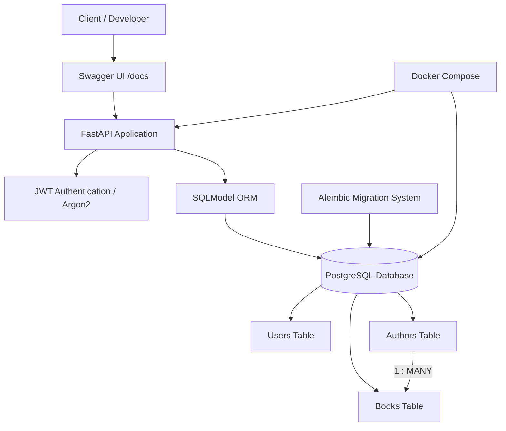

# Architecture

```mermaid
flowchart TD
    CLIENT["Client / Developer"] --> SWAGGER["Swagger UI /docs"]
    SWAGGER --> FASTAPI["FastAPI Application"]
    FASTAPI --> AUTH["JWT Authentication / Argon2"]
    FASTAPI --> SQLMODEL["SQLModel ORM"]
    SQLMODEL --> POSTGRES[("PostgreSQL Database")]
    ALEMBIC["Alembic Migration System"] --> POSTGRES
    POSTGRES --> USERS["Users Table"]
    POSTGRES --> AUTHORS["Authors Table"]
    POSTGRES --> BOOKS["Books Table"]
    AUTHORS -->|"1 : MANY"| BOOKS
    DOCKER["Docker Compose"] --> FASTAPI
    DOCKER --> POSTGRES
```
